 

[💙 RecordTimeline 바로가기 💙](http://recordtimeline.com/)
 

## 🧐 RecordTimeline 이란?

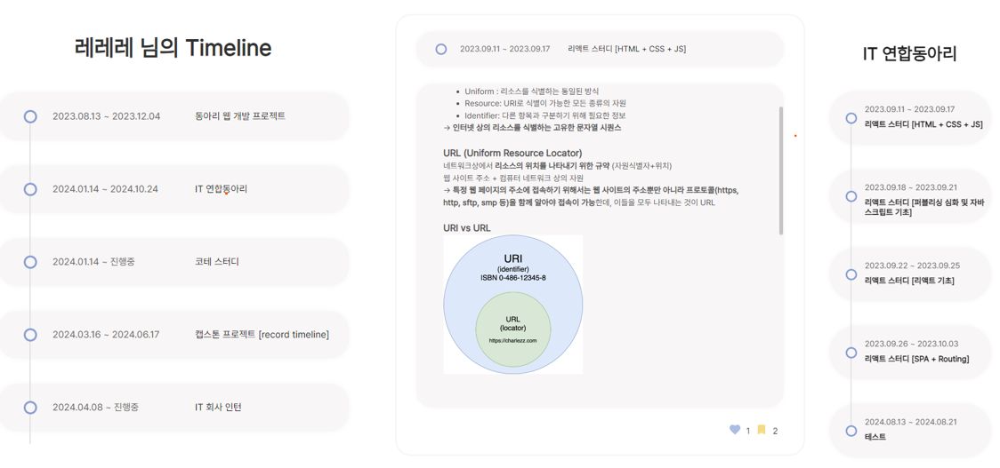

#### "Record Timeline"은 사용자가 자신의 경력과 성장 과정을 타임라인 형식으로 체계적으로 정리하고 관리할 수 있는 웹 서비스입니다.  
#### 여러분들은 혹시 무엇을 시작하려할 때 혹은 취업 준비를 하며 당장 뭐부터 시작해야할지 막막했던 경험이 있으신가요❓
#### 나와 비슷한 길을 각 있는 다른 사람들은 어떻게 경험을 쌓아가고 있는지 궁금해 검색해 보신 적 있으신가요❓
#### 나와있는 정보는 많으나 이를 한눈에 흐름으로 파악하기 어려워 나에게 맞는 방향은 뭔지,   
#### 그래서 당장 해야할 일은 뭔지 알지 못 한 채 흐지부지된 경험은 없으신가요❓ 
#### "Record Timeline"은 기존의 블로그나 정적인 플랫폼과 달리, 타임라인을 이용해 시간의 흐름에 따라 성장 과정을 직관적으로 시각화하여 보여줍니다.
#### "Record Timeline"이 성장 방향을 찾아가는 여러분들에게 구체적인 길잡이가 되기를 바랍니다 😊
 

## 😋 멤버 소개
| 박현빈 | 김사라 | 김소희 | 오유경 |
|:------:|:------:|:------:|:------:|
|  |  |  |  |
| PM, BE | FE | FE | BE |
| [hyeonbin](https://github.com/hyeonbinn) | [Sara Kim](https://github.com/saralove20) | [Sohee Kim](https://github.com/sohee5143) | [dhdbrud0510](https://github.com/oyk0510) |

 

## 🔍 주요 기능
🔒 **회원가입 및 로그인**

⏳ **메인 타임라인**

⏳ **서브 타임라인**

👩🏻‍💼 **본인 관심분야에 맞춘 사용자 및 게시글 추천**

🔖 **관심있는 타임라인 좋아요/북마크**

💬 **타임라인 댓글/대댓글**

🔎 **사용자 및 게시글 검색**

👫 **팔로우/팔로잉**

⏰ **실시간 알림**

🔁 **타임라인 pdf 변환**

📝 **경력사항 입력 및 조회**

 

## ✏️ 기능 상세
### 1. 회원가입 및 로그인
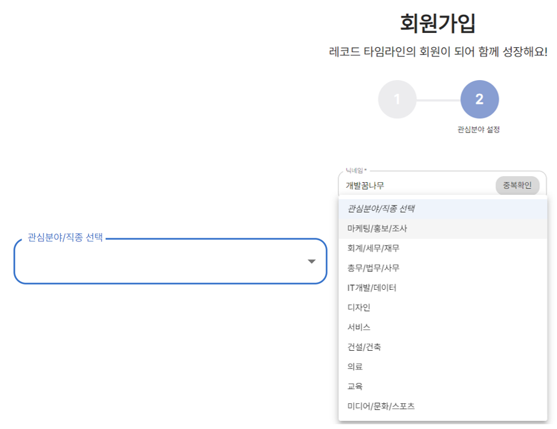   
**회원가입시 본인의 관심분야를 선택할 수 있어요!!**   
**관심분야를 설정해 자신의 성장 기록 및 경험들을 공유하고, 다양한 관심분야를 가진 사용자들과 소통할 수 있어요 🙌🏻**   
**맞춤형 사용자들과 게시글을 추천받아 보세요~!**  
   

### 2. 메인 타임라인
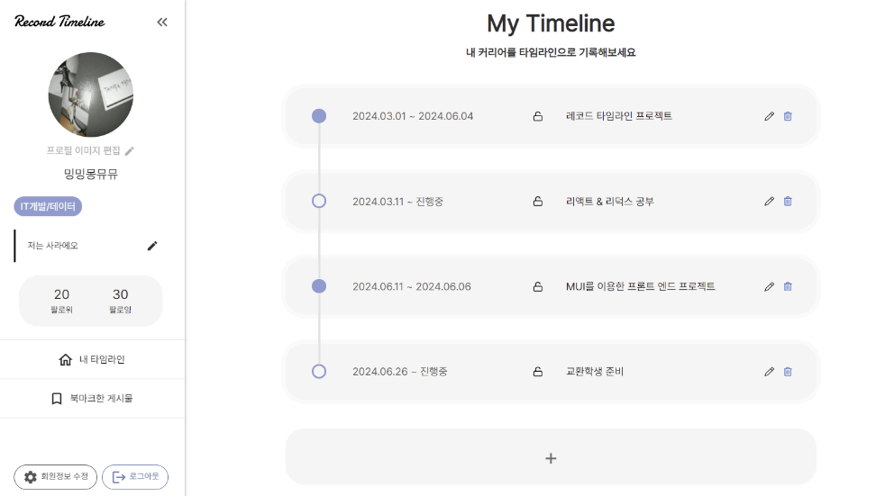   
**본인의 타임라인에 자신의 경험 및 성장 과정 등을 기록할 수 있어요**   
**타임라인들은 시작날짜를 기준으로 자동 정렬되기 때문에 성장 과정을 시각적으로 확인할 수 있습니다🙂**   
**각각의 타임라인들은 공개 여부를 설정할 수 있고, 비공개시 다른 사용자들에게는 보이지 않아요🔒**   
   

### 3. 서브 타임라인
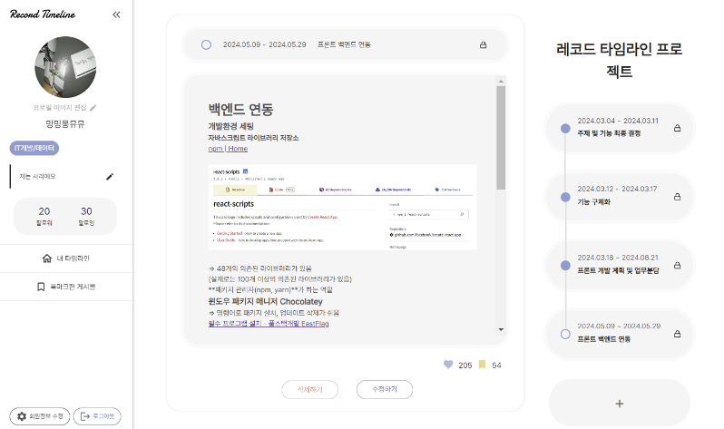   
**각각의 메인 타임라인으로 들어가면 서브타임라인이 있어요 !!**   
**게시글 형태로 더 자세히 기록할 수 있습니다 🙂 !!**   
**순서대로 기록하고 싶은데 중간에 깜빡하고 빠뜨린 경험은 없으신가요?**   
**서브 타임라인 또한 사용자가 지정한 시작날짜를 기준으로 자동 정렬되기에 중간 중간 빠진 기록들이 있어도 새로 추가해 정렬할 수 있어요! 완벽한 본인의 타임라인을 만들어보세요😊**  
   

### 4. 본인 관심분야에 맞춘 사용자 및 게시글 추천
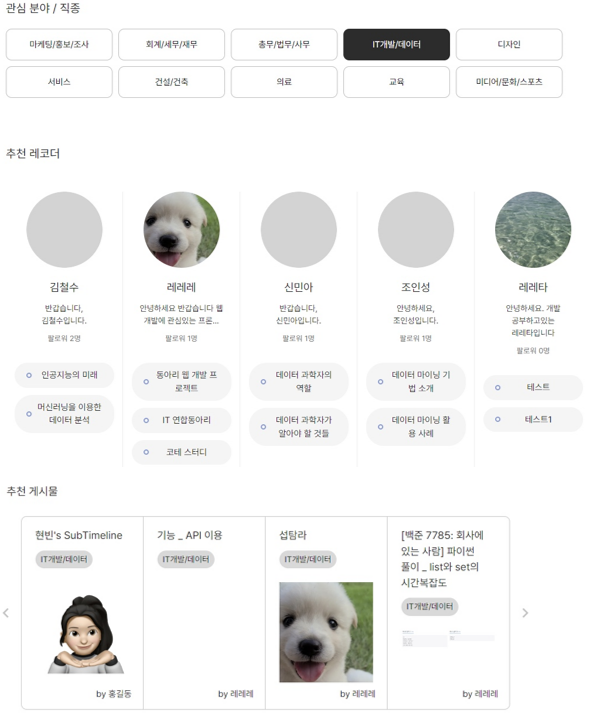   
**레코드 타임라인의 메인 페이지에는 여러 사용자와 게시글을 추천해주고 있어요!**   
**기본적으로 본인이 설정한 관심분야와 동일한 사용자 / 게시글을 추천해줍니다 !**   
**나와 같은 관심분야를 가진 사람들은 어떤 경험을 해왔는지, 어떤 도전을 하고 있는지 확인해보세요~~**   
**상단의 관심분야들을 클릭하면 다양한 관심분야를 가진 사용자들 또한 추천받을 수 있습니다!**    

### 5. 관심있는 타임라인 좋아요/북마크
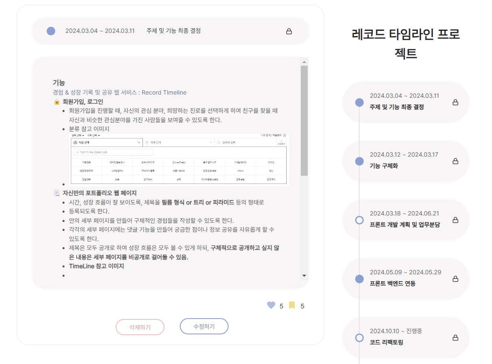   
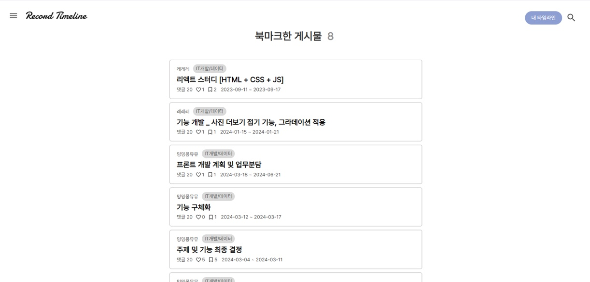   
**서브 타임라인을 구경하다 참고하고 싶은 경험, 저장하고 싶은 기록들을 발견하면 북마크로 모아둘 수 있어요**   
**관심있는 타임라인(게시글)을 북마크하고 본인의 성장에 참고해보세요 !!**   
**좋아요 기능도 활용해 서로 응원하고 소통해요~**    

### 6. 타임라인 댓글/대댓글 
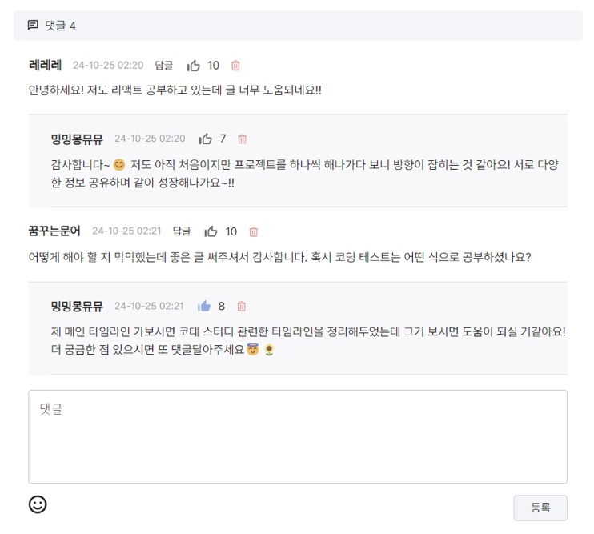   
**서브 타임라인에 댓글 및 대댓글을 달 수 있어요 !**   
**궁금한 점을 물어볼 수도 있고, 서로 소통, 응원할 수 있습니다 🙌🏻**    

### 7. 사용자 및 게시글 검색
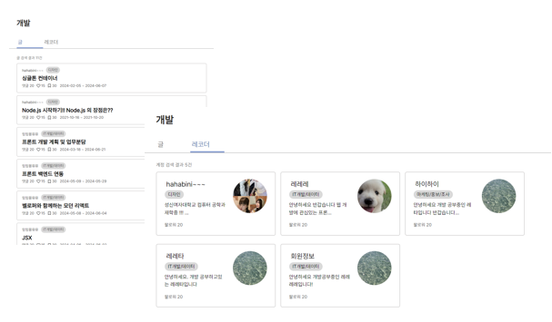   
**특정 경험을 한 사람이 있는지, 특정 과목을 공부하고 있는 사람이 있는지 궁금하다면?**   
**검색 기능을 적극 활용해보세요🔎**   
**해당 키워드로 검색된 결과를 사용자 / 게시글을 나누어 보여줍니다 🙂**    

### 8. 팔로우/팔로잉
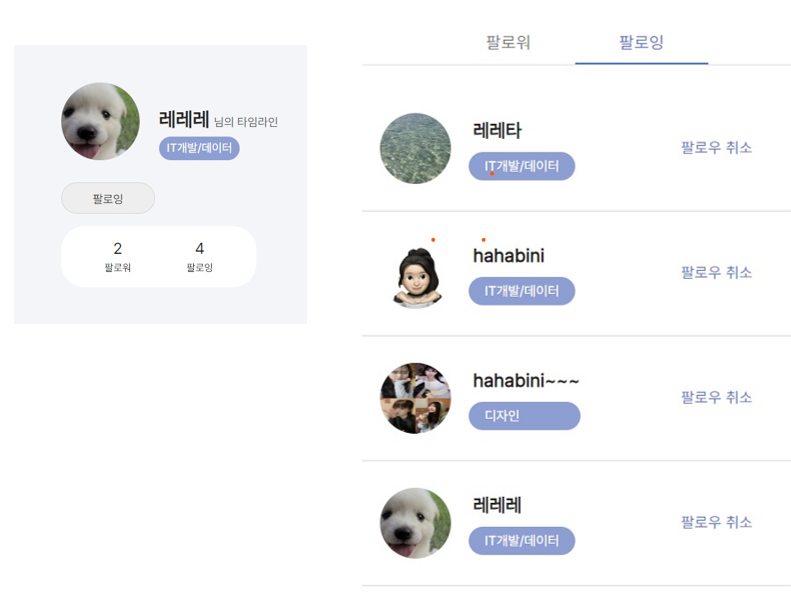   
**서로 팔로잉을 할 수 있어요. 관심있는 사용자들을 팔로우하고 쉽게 쉽게 소식을 확인하세요 !**    

### 9. 실시간 알림
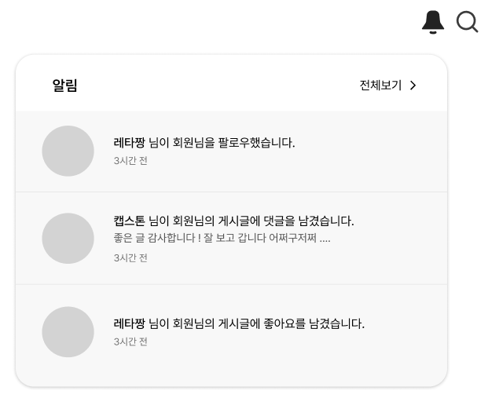   
**다른 사람이 나를 팔로잉하거나 댓글을 달면 ! 게시글이나 댓글에 좋아요를 달면! 실시간 알림을 받을 수 있어요⏰**   
**알림은 14일동안 보관되고 자동 삭제됩니다🙂**    

### 10. 타임라인 pdf 변환
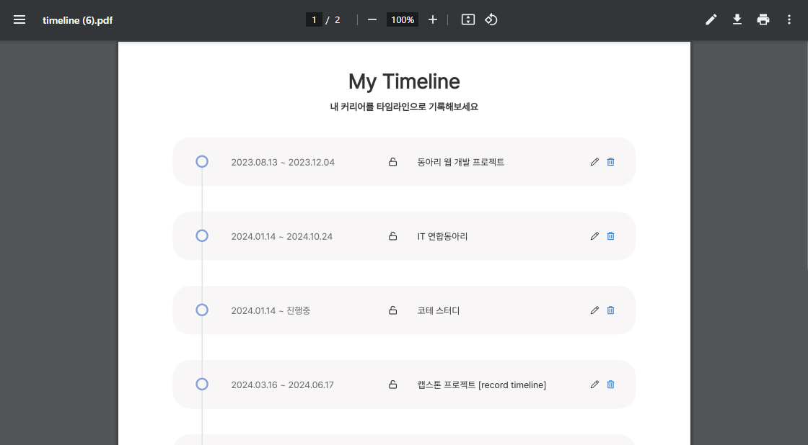   
**타임라인을 pdf로 변환해 저장할 수 있어요📁**   
**본인이 원하는 다양한 형태로 다운받아 여러 곳에 활용해보세요**    

### 11. 경력사항 입력 및 조회
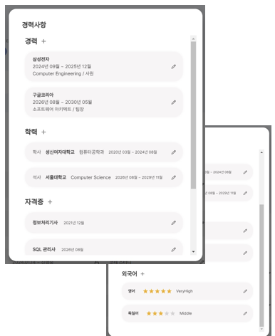    
**본인을 어필하고 싶다면❓**   
**프로필에서 경력사항을 입력해보세요! 경력, 학력, 자격증, 외국어로 다양한 분야를 입력할 수 있습니다 🙂**   
**상대방의 경력이 궁금하다면 자유롭게 구경할 수 있습니다!**    

## 👩🏻‍💻 작업 및 역할 분담
|  |  |  |
|-----------------|-----------------|-----------------|
| 박현빈     |   | <ul><li>회원가입 및 로그인 기능 구현</li><li>본인 관심분야에 맞춘 사용자 및 게시글 추천 기능 구현</li><li>검색 기능 구현</li><li>팔로우/팔로잉 기능 구현</li><li>알림 기능 구현 </li><li>경력사항 입력 및 조회 기능 구현</li></ul>     |
| 김사라   |  | <ul><li>메인 타임라인 페이지 구현</li><li>서브 타임라인 페이지 구현</li><li>북마크 페이지 구현</li><li>댓글/대댓글 페이지 구현</li><li>경력사항 입력 및 조회 페이지 구현</li></ul> |
| 김소희   |      |<ul><li>로그인 및 회원가입 페이지 구현</li><li>검색 페이지 구현</li><li>팔로우/팔로잉 목록 페이지 구현</li><li>알림 페이지 구현</li><li>타임라인 pdf 변환 기능</li></ul>  |
| 오유경    |      | <ul><li>메인 타임라인 기능 구현</li><li>서브 타임라인 기능 구현</li><li>타임라인 공개 여부 설정 기능</li><li>타임라인 좋아요/북마크 기능 구현</li><li>댓글/대댓글 기능 구현</li></ul>    |

 

## 🛠️ 기술 스택
#### Web
&nbsp;  &nbsp;&nbsp;  &nbsp; &nbsp; &nbsp; &nbsp; 

#### Server
&nbsp; &nbsp; &nbsp; &nbsp; &nbsp; &nbsp; 

#### Etc.
&nbsp; &nbsp; &nbsp; &nbsp; 

 

#### 🚨Record Timeline의 사용 매뉴얼은 추후 업로드 예정입니다 !!🚨   
